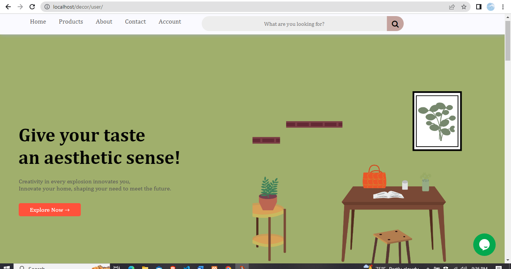
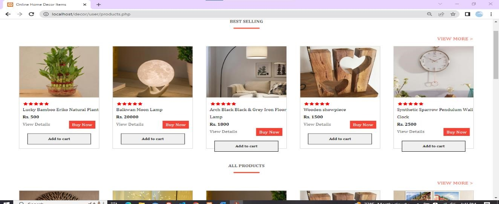
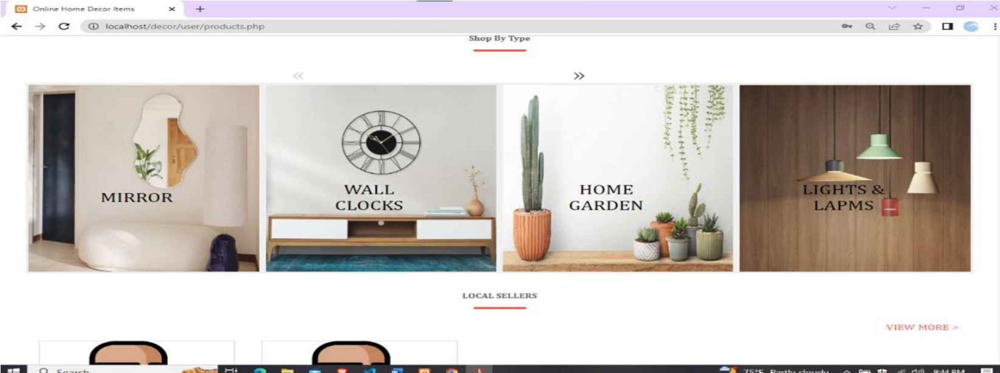
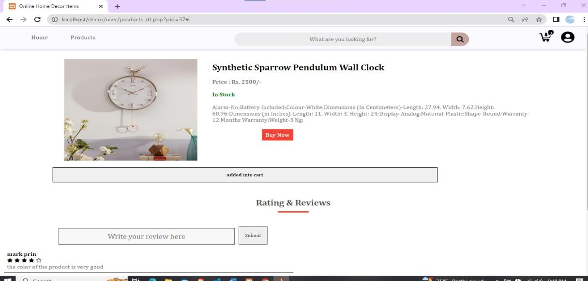
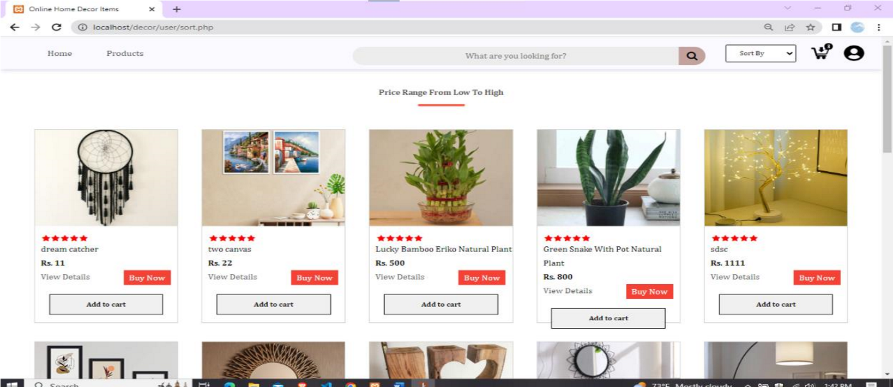
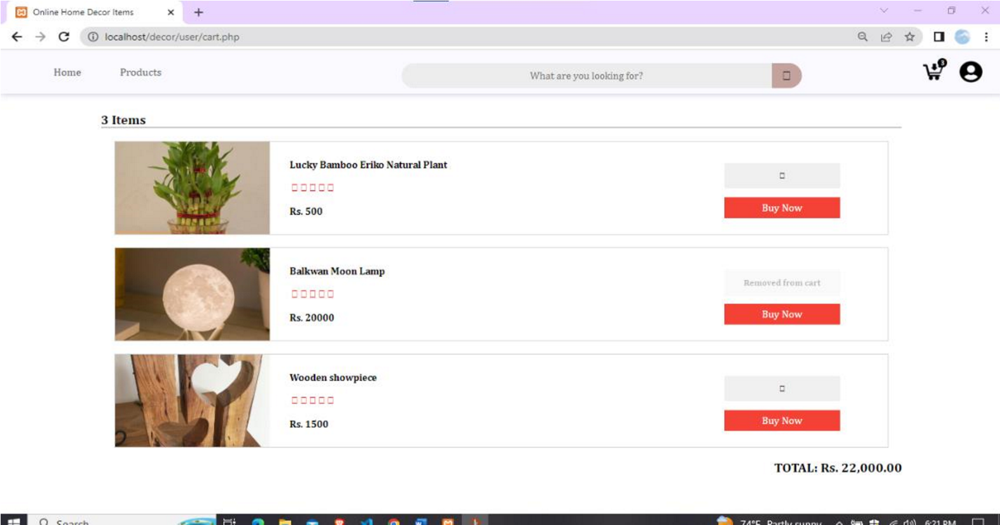
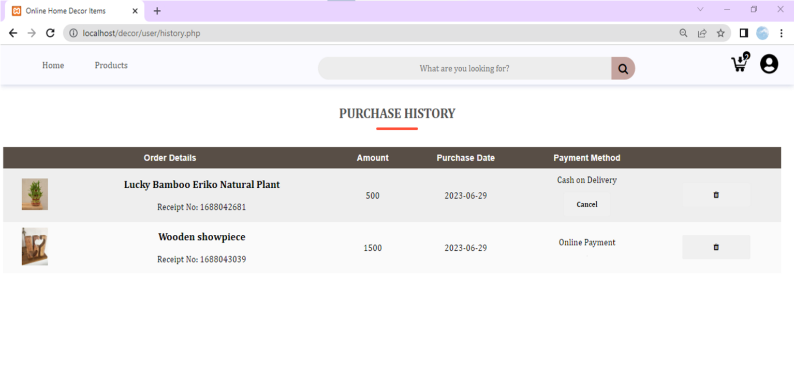
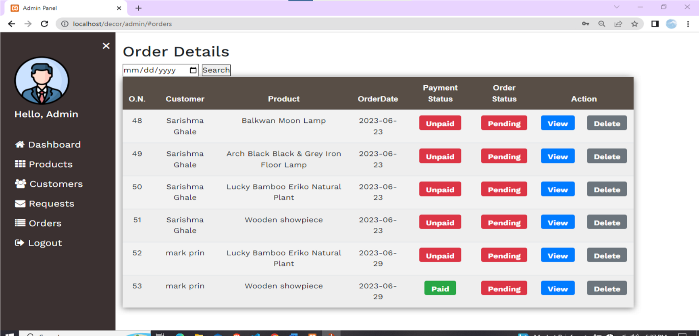
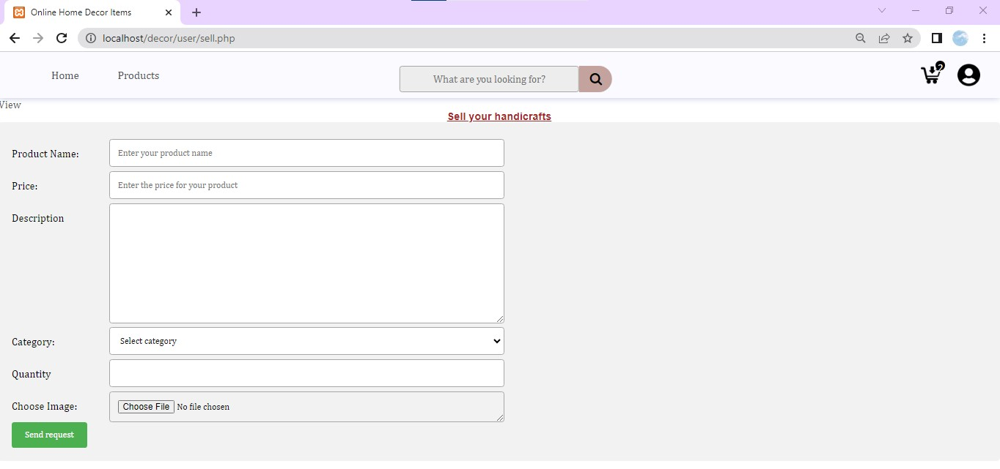

# 🛍️ E-Commerce Project

A simple and responsive **E-Commerce Website** built using **PHP**, **CSS**, and **JavaScript**.  
This project allows users to browse products, manage their shopping cart, and make purchases, while the admin can manage products and users.

---
## 🖼️ Project Screenshots  

### 🏪 Home Page
<p align="center">
  
</p>
<p align="center">
  
</p>

---

### 🛍️ Product Listings
<p align="center">
  
</p>

---

### 🔍 Product Details
<p align="center">
  
</p>

---

### 🧾 Product Sorting
Products displayed by sorting (price, category, etc.)
<p align="center">
  
</p>

---

### 🛒 My Cart
<p align="center">
  
</p>

---

### 📦 Order Summary
<p align="center">
  
</p>

---

### 👨‍💻 Admin Panel
<p align="center">
  
</p>

---

### 🧍 Seller Dashboard
A separate panel for users interested in selling products.
<p align="center">
  
</p>

---

## ✨ Features
- 🧑‍💼 User registration & login  
- 🛒 Add to cart and checkout  
- 🧾 Product listing with categories  
- 🔐 Admin panel for product/user management  
- 🗄️ Database integration using MySQL  
- 🎨 Responsive design with HTML & CSS  

---
## ⚙️ Getting Started

### ✅ Prerequisites
- Installed XAMPP or WAMP server  
- MySQL / phpMyAdmin access  
- Browser (Chrome, Firefox, Edge, etc.)

### 🧩 Installation
1. Clone this repository:
   ```bash
   git clone https://github.com/sarishmaghale/ecommerce.git
